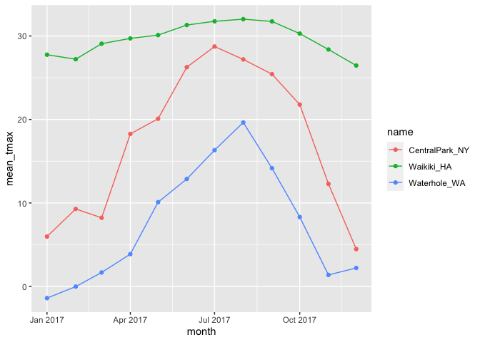

Lecture 9
================
2022-10-06

``` r
library(tidyverse)
```

    ## ── Attaching packages ─────────────────────────────────────── tidyverse 1.3.2 ──
    ## ✔ ggplot2 3.3.6      ✔ purrr   0.3.4 
    ## ✔ tibble  3.1.8      ✔ dplyr   1.0.10
    ## ✔ tidyr   1.2.0      ✔ stringr 1.4.1 
    ## ✔ readr   2.1.2      ✔ forcats 0.5.2 
    ## ── Conflicts ────────────────────────────────────────── tidyverse_conflicts() ──
    ## ✖ dplyr::filter() masks stats::filter()
    ## ✖ dplyr::lag()    masks stats::lag()

Conduct exploratory analyses using `dplyr` verbs (`group_by` and
`summarize`), along with numeric data summaries.

# Example

We’ll continue in the same Git repo / R project that we used for
visualization, and use essentially the same `weather_df` dataset – the
only exception is the addition of `month` variable, created using
`lubridate::floor_date()`.

``` r
weather_df =  
  rnoaa::meteo_pull_monitors(
    c("USW00094728", "USC00519397", "USS0023B17S"),
    var = c("PRCP", "TMIN", "TMAX"), 
    date_min = "2017-01-01",
    date_max = "2017-12-31") %>%
  mutate(
    name = recode(
      id, 
      USW00094728 = "CentralPark_NY", 
      USC00519397 = "Waikiki_HA",
      USS0023B17S = "Waterhole_WA"),
    tmin = tmin / 10,
    tmax = tmax / 10,
    month = lubridate::floor_date(date, unit = "month")) %>%
  select(name, id, everything())
```

    ## Registered S3 method overwritten by 'hoardr':
    ##   method           from
    ##   print.cache_info httr

    ## using cached file: ~/Library/Caches/R/noaa_ghcnd/USW00094728.dly

    ## date created (size, mb): 2022-09-29 10:30:38 (8.401)

    ## file min/max dates: 1869-01-01 / 2022-09-30

    ## using cached file: ~/Library/Caches/R/noaa_ghcnd/USC00519397.dly

    ## date created (size, mb): 2022-09-29 10:30:41 (1.699)

    ## file min/max dates: 1965-01-01 / 2020-03-31

    ## using cached file: ~/Library/Caches/R/noaa_ghcnd/USS0023B17S.dly

    ## date created (size, mb): 2022-09-29 10:30:43 (0.95)

    ## file min/max dates: 1999-09-01 / 2022-09-30

## `group_by`

Datasets are often comprised of groups defined by one or more
(categorical) variable; `group_by()` makes these groupings explicit so
that they can be included in subsequent operations. For example, we
might group `weather_df` by `name` and `month`:

``` r
weather_df %>%
  group_by(name, month)
```

    ## # A tibble: 1,095 × 7
    ## # Groups:   name, month [36]
    ##    name           id          date        prcp  tmax  tmin month     
    ##    <chr>          <chr>       <date>     <dbl> <dbl> <dbl> <date>    
    ##  1 CentralPark_NY USW00094728 2017-01-01     0   8.9   4.4 2017-01-01
    ##  2 CentralPark_NY USW00094728 2017-01-02    53   5     2.8 2017-01-01
    ##  3 CentralPark_NY USW00094728 2017-01-03   147   6.1   3.9 2017-01-01
    ##  4 CentralPark_NY USW00094728 2017-01-04     0  11.1   1.1 2017-01-01
    ##  5 CentralPark_NY USW00094728 2017-01-05     0   1.1  -2.7 2017-01-01
    ##  6 CentralPark_NY USW00094728 2017-01-06    13   0.6  -3.8 2017-01-01
    ##  7 CentralPark_NY USW00094728 2017-01-07    81  -3.2  -6.6 2017-01-01
    ##  8 CentralPark_NY USW00094728 2017-01-08     0  -3.8  -8.8 2017-01-01
    ##  9 CentralPark_NY USW00094728 2017-01-09     0  -4.9  -9.9 2017-01-01
    ## 10 CentralPark_NY USW00094728 2017-01-10     0   7.8  -6   2017-01-01
    ## # … with 1,085 more rows

Output: `Groups:   name, month [36]` - 36 distinct groups: 12 groups for
3 names

Not changing the dataset in anyway

Several important functions respect grouping structures. You will
frequently use summarize to create one-number summaries within each
group, or use mutate to define variables within groups. The rest of this
example shows these functions in action.

Because these (and other) functions will use grouping information if it
exists, it is sometimes necessary to remove groups using `ungroup()`.

## *Counting things*

As an intro to `summarize`, let’s count the number of observations in
each month in the complete `weather_df` dataset.

``` r
weather_df %>%
  group_by(month) %>%
  summarize(n_obs = n())
```

    ## # A tibble: 12 × 2
    ##    month      n_obs
    ##    <date>     <int>
    ##  1 2017-01-01    93
    ##  2 2017-02-01    84
    ##  3 2017-03-01    93
    ##  4 2017-04-01    90
    ##  5 2017-05-01    93
    ##  6 2017-06-01    90
    ##  7 2017-07-01    93
    ##  8 2017-08-01    93
    ##  9 2017-09-01    90
    ## 10 2017-10-01    93
    ## 11 2017-11-01    90
    ## 12 2017-12-01    93

For each month, how many observations is the output

``` r
weather_df %>% 
  group_by(name) %>% 
  summarize(
    n_obs = n()
  )
```

    ## # A tibble: 3 × 2
    ##   name           n_obs
    ##   <chr>          <int>
    ## 1 CentralPark_NY   365
    ## 2 Waikiki_HA       365
    ## 3 Waterhole_WA     365

`n()` = will count how many observations within each variable identified
in `group_by()`

The output states that there are 3 groups and how many observations are
in each group - CentralPark_NY = 365 - Waikiki_HA = 365 - Waterhole_WA =
365

We can group by more than one variable, too.

``` r
weather_df %>%
  group_by(name, month) %>%
  summarize(n_obs = n())
```

    ## `summarise()` has grouped output by 'name'. You can override using the
    ## `.groups` argument.

    ## # A tibble: 36 × 3
    ## # Groups:   name [3]
    ##    name           month      n_obs
    ##    <chr>          <date>     <int>
    ##  1 CentralPark_NY 2017-01-01    31
    ##  2 CentralPark_NY 2017-02-01    28
    ##  3 CentralPark_NY 2017-03-01    31
    ##  4 CentralPark_NY 2017-04-01    30
    ##  5 CentralPark_NY 2017-05-01    31
    ##  6 CentralPark_NY 2017-06-01    30
    ##  7 CentralPark_NY 2017-07-01    31
    ##  8 CentralPark_NY 2017-08-01    31
    ##  9 CentralPark_NY 2017-09-01    30
    ## 10 CentralPark_NY 2017-10-01    31
    ## # … with 26 more rows

Will output the number of observation for each month of each group -
there will be 36 rows: 12 months for 3 groups

# `Count()`

``` r
weather_df %>% 
  count(name)
```

    ## # A tibble: 3 × 2
    ##   name               n
    ##   <chr>          <int>
    ## 1 CentralPark_NY   365
    ## 2 Waikiki_HA       365
    ## 3 Waterhole_WA     365

Will do the same thing as `summarize(n_obs = n())`

Don’t use `table()`!

``` r
weather_df %>% 
  pull(month)
```

    ##    [1] "2017-01-01" "2017-01-01" "2017-01-01" "2017-01-01" "2017-01-01"
    ##    [6] "2017-01-01" "2017-01-01" "2017-01-01" "2017-01-01" "2017-01-01"
    ##   [11] "2017-01-01" "2017-01-01" "2017-01-01" "2017-01-01" "2017-01-01"
    ##   [16] "2017-01-01" "2017-01-01" "2017-01-01" "2017-01-01" "2017-01-01"
    ##   [21] "2017-01-01" "2017-01-01" "2017-01-01" "2017-01-01" "2017-01-01"
    ##   [26] "2017-01-01" "2017-01-01" "2017-01-01" "2017-01-01" "2017-01-01"
    ##   [31] "2017-01-01" "2017-02-01" "2017-02-01" "2017-02-01" "2017-02-01"
    ##   [36] "2017-02-01" "2017-02-01" "2017-02-01" "2017-02-01" "2017-02-01"
    ##   [41] "2017-02-01" "2017-02-01" "2017-02-01" "2017-02-01" "2017-02-01"
    ##   [46] "2017-02-01" "2017-02-01" "2017-02-01" "2017-02-01" "2017-02-01"
    ##   [51] "2017-02-01" "2017-02-01" "2017-02-01" "2017-02-01" "2017-02-01"
    ##   [56] "2017-02-01" "2017-02-01" "2017-02-01" "2017-02-01" "2017-03-01"
    ##   [61] "2017-03-01" "2017-03-01" "2017-03-01" "2017-03-01" "2017-03-01"
    ##   [66] "2017-03-01" "2017-03-01" "2017-03-01" "2017-03-01" "2017-03-01"
    ##   [71] "2017-03-01" "2017-03-01" "2017-03-01" "2017-03-01" "2017-03-01"
    ##   [76] "2017-03-01" "2017-03-01" "2017-03-01" "2017-03-01" "2017-03-01"
    ##   [81] "2017-03-01" "2017-03-01" "2017-03-01" "2017-03-01" "2017-03-01"
    ##   [86] "2017-03-01" "2017-03-01" "2017-03-01" "2017-03-01" "2017-03-01"
    ##   [91] "2017-04-01" "2017-04-01" "2017-04-01" "2017-04-01" "2017-04-01"
    ##   [96] "2017-04-01" "2017-04-01" "2017-04-01" "2017-04-01" "2017-04-01"
    ##  [101] "2017-04-01" "2017-04-01" "2017-04-01" "2017-04-01" "2017-04-01"
    ##  [106] "2017-04-01" "2017-04-01" "2017-04-01" "2017-04-01" "2017-04-01"
    ##  [111] "2017-04-01" "2017-04-01" "2017-04-01" "2017-04-01" "2017-04-01"
    ##  [116] "2017-04-01" "2017-04-01" "2017-04-01" "2017-04-01" "2017-04-01"
    ##  [121] "2017-05-01" "2017-05-01" "2017-05-01" "2017-05-01" "2017-05-01"
    ##  [126] "2017-05-01" "2017-05-01" "2017-05-01" "2017-05-01" "2017-05-01"
    ##  [131] "2017-05-01" "2017-05-01" "2017-05-01" "2017-05-01" "2017-05-01"
    ##  [136] "2017-05-01" "2017-05-01" "2017-05-01" "2017-05-01" "2017-05-01"
    ##  [141] "2017-05-01" "2017-05-01" "2017-05-01" "2017-05-01" "2017-05-01"
    ##  [146] "2017-05-01" "2017-05-01" "2017-05-01" "2017-05-01" "2017-05-01"
    ##  [151] "2017-05-01" "2017-06-01" "2017-06-01" "2017-06-01" "2017-06-01"
    ##  [156] "2017-06-01" "2017-06-01" "2017-06-01" "2017-06-01" "2017-06-01"
    ##  [161] "2017-06-01" "2017-06-01" "2017-06-01" "2017-06-01" "2017-06-01"
    ##  [166] "2017-06-01" "2017-06-01" "2017-06-01" "2017-06-01" "2017-06-01"
    ##  [171] "2017-06-01" "2017-06-01" "2017-06-01" "2017-06-01" "2017-06-01"
    ##  [176] "2017-06-01" "2017-06-01" "2017-06-01" "2017-06-01" "2017-06-01"
    ##  [181] "2017-06-01" "2017-07-01" "2017-07-01" "2017-07-01" "2017-07-01"
    ##  [186] "2017-07-01" "2017-07-01" "2017-07-01" "2017-07-01" "2017-07-01"
    ##  [191] "2017-07-01" "2017-07-01" "2017-07-01" "2017-07-01" "2017-07-01"
    ##  [196] "2017-07-01" "2017-07-01" "2017-07-01" "2017-07-01" "2017-07-01"
    ##  [201] "2017-07-01" "2017-07-01" "2017-07-01" "2017-07-01" "2017-07-01"
    ##  [206] "2017-07-01" "2017-07-01" "2017-07-01" "2017-07-01" "2017-07-01"
    ##  [211] "2017-07-01" "2017-07-01" "2017-08-01" "2017-08-01" "2017-08-01"
    ##  [216] "2017-08-01" "2017-08-01" "2017-08-01" "2017-08-01" "2017-08-01"
    ##  [221] "2017-08-01" "2017-08-01" "2017-08-01" "2017-08-01" "2017-08-01"
    ##  [226] "2017-08-01" "2017-08-01" "2017-08-01" "2017-08-01" "2017-08-01"
    ##  [231] "2017-08-01" "2017-08-01" "2017-08-01" "2017-08-01" "2017-08-01"
    ##  [236] "2017-08-01" "2017-08-01" "2017-08-01" "2017-08-01" "2017-08-01"
    ##  [241] "2017-08-01" "2017-08-01" "2017-08-01" "2017-09-01" "2017-09-01"
    ##  [246] "2017-09-01" "2017-09-01" "2017-09-01" "2017-09-01" "2017-09-01"
    ##  [251] "2017-09-01" "2017-09-01" "2017-09-01" "2017-09-01" "2017-09-01"
    ##  [256] "2017-09-01" "2017-09-01" "2017-09-01" "2017-09-01" "2017-09-01"
    ##  [261] "2017-09-01" "2017-09-01" "2017-09-01" "2017-09-01" "2017-09-01"
    ##  [266] "2017-09-01" "2017-09-01" "2017-09-01" "2017-09-01" "2017-09-01"
    ##  [271] "2017-09-01" "2017-09-01" "2017-09-01" "2017-10-01" "2017-10-01"
    ##  [276] "2017-10-01" "2017-10-01" "2017-10-01" "2017-10-01" "2017-10-01"
    ##  [281] "2017-10-01" "2017-10-01" "2017-10-01" "2017-10-01" "2017-10-01"
    ##  [286] "2017-10-01" "2017-10-01" "2017-10-01" "2017-10-01" "2017-10-01"
    ##  [291] "2017-10-01" "2017-10-01" "2017-10-01" "2017-10-01" "2017-10-01"
    ##  [296] "2017-10-01" "2017-10-01" "2017-10-01" "2017-10-01" "2017-10-01"
    ##  [301] "2017-10-01" "2017-10-01" "2017-10-01" "2017-10-01" "2017-11-01"
    ##  [306] "2017-11-01" "2017-11-01" "2017-11-01" "2017-11-01" "2017-11-01"
    ##  [311] "2017-11-01" "2017-11-01" "2017-11-01" "2017-11-01" "2017-11-01"
    ##  [316] "2017-11-01" "2017-11-01" "2017-11-01" "2017-11-01" "2017-11-01"
    ##  [321] "2017-11-01" "2017-11-01" "2017-11-01" "2017-11-01" "2017-11-01"
    ##  [326] "2017-11-01" "2017-11-01" "2017-11-01" "2017-11-01" "2017-11-01"
    ##  [331] "2017-11-01" "2017-11-01" "2017-11-01" "2017-11-01" "2017-12-01"
    ##  [336] "2017-12-01" "2017-12-01" "2017-12-01" "2017-12-01" "2017-12-01"
    ##  [341] "2017-12-01" "2017-12-01" "2017-12-01" "2017-12-01" "2017-12-01"
    ##  [346] "2017-12-01" "2017-12-01" "2017-12-01" "2017-12-01" "2017-12-01"
    ##  [351] "2017-12-01" "2017-12-01" "2017-12-01" "2017-12-01" "2017-12-01"
    ##  [356] "2017-12-01" "2017-12-01" "2017-12-01" "2017-12-01" "2017-12-01"
    ##  [361] "2017-12-01" "2017-12-01" "2017-12-01" "2017-12-01" "2017-12-01"
    ##  [366] "2017-01-01" "2017-01-01" "2017-01-01" "2017-01-01" "2017-01-01"
    ##  [371] "2017-01-01" "2017-01-01" "2017-01-01" "2017-01-01" "2017-01-01"
    ##  [376] "2017-01-01" "2017-01-01" "2017-01-01" "2017-01-01" "2017-01-01"
    ##  [381] "2017-01-01" "2017-01-01" "2017-01-01" "2017-01-01" "2017-01-01"
    ##  [386] "2017-01-01" "2017-01-01" "2017-01-01" "2017-01-01" "2017-01-01"
    ##  [391] "2017-01-01" "2017-01-01" "2017-01-01" "2017-01-01" "2017-01-01"
    ##  [396] "2017-01-01" "2017-02-01" "2017-02-01" "2017-02-01" "2017-02-01"
    ##  [401] "2017-02-01" "2017-02-01" "2017-02-01" "2017-02-01" "2017-02-01"
    ##  [406] "2017-02-01" "2017-02-01" "2017-02-01" "2017-02-01" "2017-02-01"
    ##  [411] "2017-02-01" "2017-02-01" "2017-02-01" "2017-02-01" "2017-02-01"
    ##  [416] "2017-02-01" "2017-02-01" "2017-02-01" "2017-02-01" "2017-02-01"
    ##  [421] "2017-02-01" "2017-02-01" "2017-02-01" "2017-02-01" "2017-03-01"
    ##  [426] "2017-03-01" "2017-03-01" "2017-03-01" "2017-03-01" "2017-03-01"
    ##  [431] "2017-03-01" "2017-03-01" "2017-03-01" "2017-03-01" "2017-03-01"
    ##  [436] "2017-03-01" "2017-03-01" "2017-03-01" "2017-03-01" "2017-03-01"
    ##  [441] "2017-03-01" "2017-03-01" "2017-03-01" "2017-03-01" "2017-03-01"
    ##  [446] "2017-03-01" "2017-03-01" "2017-03-01" "2017-03-01" "2017-03-01"
    ##  [451] "2017-03-01" "2017-03-01" "2017-03-01" "2017-03-01" "2017-03-01"
    ##  [456] "2017-04-01" "2017-04-01" "2017-04-01" "2017-04-01" "2017-04-01"
    ##  [461] "2017-04-01" "2017-04-01" "2017-04-01" "2017-04-01" "2017-04-01"
    ##  [466] "2017-04-01" "2017-04-01" "2017-04-01" "2017-04-01" "2017-04-01"
    ##  [471] "2017-04-01" "2017-04-01" "2017-04-01" "2017-04-01" "2017-04-01"
    ##  [476] "2017-04-01" "2017-04-01" "2017-04-01" "2017-04-01" "2017-04-01"
    ##  [481] "2017-04-01" "2017-04-01" "2017-04-01" "2017-04-01" "2017-04-01"
    ##  [486] "2017-05-01" "2017-05-01" "2017-05-01" "2017-05-01" "2017-05-01"
    ##  [491] "2017-05-01" "2017-05-01" "2017-05-01" "2017-05-01" "2017-05-01"
    ##  [496] "2017-05-01" "2017-05-01" "2017-05-01" "2017-05-01" "2017-05-01"
    ##  [501] "2017-05-01" "2017-05-01" "2017-05-01" "2017-05-01" "2017-05-01"
    ##  [506] "2017-05-01" "2017-05-01" "2017-05-01" "2017-05-01" "2017-05-01"
    ##  [511] "2017-05-01" "2017-05-01" "2017-05-01" "2017-05-01" "2017-05-01"
    ##  [516] "2017-05-01" "2017-06-01" "2017-06-01" "2017-06-01" "2017-06-01"
    ##  [521] "2017-06-01" "2017-06-01" "2017-06-01" "2017-06-01" "2017-06-01"
    ##  [526] "2017-06-01" "2017-06-01" "2017-06-01" "2017-06-01" "2017-06-01"
    ##  [531] "2017-06-01" "2017-06-01" "2017-06-01" "2017-06-01" "2017-06-01"
    ##  [536] "2017-06-01" "2017-06-01" "2017-06-01" "2017-06-01" "2017-06-01"
    ##  [541] "2017-06-01" "2017-06-01" "2017-06-01" "2017-06-01" "2017-06-01"
    ##  [546] "2017-06-01" "2017-07-01" "2017-07-01" "2017-07-01" "2017-07-01"
    ##  [551] "2017-07-01" "2017-07-01" "2017-07-01" "2017-07-01" "2017-07-01"
    ##  [556] "2017-07-01" "2017-07-01" "2017-07-01" "2017-07-01" "2017-07-01"
    ##  [561] "2017-07-01" "2017-07-01" "2017-07-01" "2017-07-01" "2017-07-01"
    ##  [566] "2017-07-01" "2017-07-01" "2017-07-01" "2017-07-01" "2017-07-01"
    ##  [571] "2017-07-01" "2017-07-01" "2017-07-01" "2017-07-01" "2017-07-01"
    ##  [576] "2017-07-01" "2017-07-01" "2017-08-01" "2017-08-01" "2017-08-01"
    ##  [581] "2017-08-01" "2017-08-01" "2017-08-01" "2017-08-01" "2017-08-01"
    ##  [586] "2017-08-01" "2017-08-01" "2017-08-01" "2017-08-01" "2017-08-01"
    ##  [591] "2017-08-01" "2017-08-01" "2017-08-01" "2017-08-01" "2017-08-01"
    ##  [596] "2017-08-01" "2017-08-01" "2017-08-01" "2017-08-01" "2017-08-01"
    ##  [601] "2017-08-01" "2017-08-01" "2017-08-01" "2017-08-01" "2017-08-01"
    ##  [606] "2017-08-01" "2017-08-01" "2017-08-01" "2017-09-01" "2017-09-01"
    ##  [611] "2017-09-01" "2017-09-01" "2017-09-01" "2017-09-01" "2017-09-01"
    ##  [616] "2017-09-01" "2017-09-01" "2017-09-01" "2017-09-01" "2017-09-01"
    ##  [621] "2017-09-01" "2017-09-01" "2017-09-01" "2017-09-01" "2017-09-01"
    ##  [626] "2017-09-01" "2017-09-01" "2017-09-01" "2017-09-01" "2017-09-01"
    ##  [631] "2017-09-01" "2017-09-01" "2017-09-01" "2017-09-01" "2017-09-01"
    ##  [636] "2017-09-01" "2017-09-01" "2017-09-01" "2017-10-01" "2017-10-01"
    ##  [641] "2017-10-01" "2017-10-01" "2017-10-01" "2017-10-01" "2017-10-01"
    ##  [646] "2017-10-01" "2017-10-01" "2017-10-01" "2017-10-01" "2017-10-01"
    ##  [651] "2017-10-01" "2017-10-01" "2017-10-01" "2017-10-01" "2017-10-01"
    ##  [656] "2017-10-01" "2017-10-01" "2017-10-01" "2017-10-01" "2017-10-01"
    ##  [661] "2017-10-01" "2017-10-01" "2017-10-01" "2017-10-01" "2017-10-01"
    ##  [666] "2017-10-01" "2017-10-01" "2017-10-01" "2017-10-01" "2017-11-01"
    ##  [671] "2017-11-01" "2017-11-01" "2017-11-01" "2017-11-01" "2017-11-01"
    ##  [676] "2017-11-01" "2017-11-01" "2017-11-01" "2017-11-01" "2017-11-01"
    ##  [681] "2017-11-01" "2017-11-01" "2017-11-01" "2017-11-01" "2017-11-01"
    ##  [686] "2017-11-01" "2017-11-01" "2017-11-01" "2017-11-01" "2017-11-01"
    ##  [691] "2017-11-01" "2017-11-01" "2017-11-01" "2017-11-01" "2017-11-01"
    ##  [696] "2017-11-01" "2017-11-01" "2017-11-01" "2017-11-01" "2017-12-01"
    ##  [701] "2017-12-01" "2017-12-01" "2017-12-01" "2017-12-01" "2017-12-01"
    ##  [706] "2017-12-01" "2017-12-01" "2017-12-01" "2017-12-01" "2017-12-01"
    ##  [711] "2017-12-01" "2017-12-01" "2017-12-01" "2017-12-01" "2017-12-01"
    ##  [716] "2017-12-01" "2017-12-01" "2017-12-01" "2017-12-01" "2017-12-01"
    ##  [721] "2017-12-01" "2017-12-01" "2017-12-01" "2017-12-01" "2017-12-01"
    ##  [726] "2017-12-01" "2017-12-01" "2017-12-01" "2017-12-01" "2017-12-01"
    ##  [731] "2017-01-01" "2017-01-01" "2017-01-01" "2017-01-01" "2017-01-01"
    ##  [736] "2017-01-01" "2017-01-01" "2017-01-01" "2017-01-01" "2017-01-01"
    ##  [741] "2017-01-01" "2017-01-01" "2017-01-01" "2017-01-01" "2017-01-01"
    ##  [746] "2017-01-01" "2017-01-01" "2017-01-01" "2017-01-01" "2017-01-01"
    ##  [751] "2017-01-01" "2017-01-01" "2017-01-01" "2017-01-01" "2017-01-01"
    ##  [756] "2017-01-01" "2017-01-01" "2017-01-01" "2017-01-01" "2017-01-01"
    ##  [761] "2017-01-01" "2017-02-01" "2017-02-01" "2017-02-01" "2017-02-01"
    ##  [766] "2017-02-01" "2017-02-01" "2017-02-01" "2017-02-01" "2017-02-01"
    ##  [771] "2017-02-01" "2017-02-01" "2017-02-01" "2017-02-01" "2017-02-01"
    ##  [776] "2017-02-01" "2017-02-01" "2017-02-01" "2017-02-01" "2017-02-01"
    ##  [781] "2017-02-01" "2017-02-01" "2017-02-01" "2017-02-01" "2017-02-01"
    ##  [786] "2017-02-01" "2017-02-01" "2017-02-01" "2017-02-01" "2017-03-01"
    ##  [791] "2017-03-01" "2017-03-01" "2017-03-01" "2017-03-01" "2017-03-01"
    ##  [796] "2017-03-01" "2017-03-01" "2017-03-01" "2017-03-01" "2017-03-01"
    ##  [801] "2017-03-01" "2017-03-01" "2017-03-01" "2017-03-01" "2017-03-01"
    ##  [806] "2017-03-01" "2017-03-01" "2017-03-01" "2017-03-01" "2017-03-01"
    ##  [811] "2017-03-01" "2017-03-01" "2017-03-01" "2017-03-01" "2017-03-01"
    ##  [816] "2017-03-01" "2017-03-01" "2017-03-01" "2017-03-01" "2017-03-01"
    ##  [821] "2017-04-01" "2017-04-01" "2017-04-01" "2017-04-01" "2017-04-01"
    ##  [826] "2017-04-01" "2017-04-01" "2017-04-01" "2017-04-01" "2017-04-01"
    ##  [831] "2017-04-01" "2017-04-01" "2017-04-01" "2017-04-01" "2017-04-01"
    ##  [836] "2017-04-01" "2017-04-01" "2017-04-01" "2017-04-01" "2017-04-01"
    ##  [841] "2017-04-01" "2017-04-01" "2017-04-01" "2017-04-01" "2017-04-01"
    ##  [846] "2017-04-01" "2017-04-01" "2017-04-01" "2017-04-01" "2017-04-01"
    ##  [851] "2017-05-01" "2017-05-01" "2017-05-01" "2017-05-01" "2017-05-01"
    ##  [856] "2017-05-01" "2017-05-01" "2017-05-01" "2017-05-01" "2017-05-01"
    ##  [861] "2017-05-01" "2017-05-01" "2017-05-01" "2017-05-01" "2017-05-01"
    ##  [866] "2017-05-01" "2017-05-01" "2017-05-01" "2017-05-01" "2017-05-01"
    ##  [871] "2017-05-01" "2017-05-01" "2017-05-01" "2017-05-01" "2017-05-01"
    ##  [876] "2017-05-01" "2017-05-01" "2017-05-01" "2017-05-01" "2017-05-01"
    ##  [881] "2017-05-01" "2017-06-01" "2017-06-01" "2017-06-01" "2017-06-01"
    ##  [886] "2017-06-01" "2017-06-01" "2017-06-01" "2017-06-01" "2017-06-01"
    ##  [891] "2017-06-01" "2017-06-01" "2017-06-01" "2017-06-01" "2017-06-01"
    ##  [896] "2017-06-01" "2017-06-01" "2017-06-01" "2017-06-01" "2017-06-01"
    ##  [901] "2017-06-01" "2017-06-01" "2017-06-01" "2017-06-01" "2017-06-01"
    ##  [906] "2017-06-01" "2017-06-01" "2017-06-01" "2017-06-01" "2017-06-01"
    ##  [911] "2017-06-01" "2017-07-01" "2017-07-01" "2017-07-01" "2017-07-01"
    ##  [916] "2017-07-01" "2017-07-01" "2017-07-01" "2017-07-01" "2017-07-01"
    ##  [921] "2017-07-01" "2017-07-01" "2017-07-01" "2017-07-01" "2017-07-01"
    ##  [926] "2017-07-01" "2017-07-01" "2017-07-01" "2017-07-01" "2017-07-01"
    ##  [931] "2017-07-01" "2017-07-01" "2017-07-01" "2017-07-01" "2017-07-01"
    ##  [936] "2017-07-01" "2017-07-01" "2017-07-01" "2017-07-01" "2017-07-01"
    ##  [941] "2017-07-01" "2017-07-01" "2017-08-01" "2017-08-01" "2017-08-01"
    ##  [946] "2017-08-01" "2017-08-01" "2017-08-01" "2017-08-01" "2017-08-01"
    ##  [951] "2017-08-01" "2017-08-01" "2017-08-01" "2017-08-01" "2017-08-01"
    ##  [956] "2017-08-01" "2017-08-01" "2017-08-01" "2017-08-01" "2017-08-01"
    ##  [961] "2017-08-01" "2017-08-01" "2017-08-01" "2017-08-01" "2017-08-01"
    ##  [966] "2017-08-01" "2017-08-01" "2017-08-01" "2017-08-01" "2017-08-01"
    ##  [971] "2017-08-01" "2017-08-01" "2017-08-01" "2017-09-01" "2017-09-01"
    ##  [976] "2017-09-01" "2017-09-01" "2017-09-01" "2017-09-01" "2017-09-01"
    ##  [981] "2017-09-01" "2017-09-01" "2017-09-01" "2017-09-01" "2017-09-01"
    ##  [986] "2017-09-01" "2017-09-01" "2017-09-01" "2017-09-01" "2017-09-01"
    ##  [991] "2017-09-01" "2017-09-01" "2017-09-01" "2017-09-01" "2017-09-01"
    ##  [996] "2017-09-01" "2017-09-01" "2017-09-01" "2017-09-01" "2017-09-01"
    ## [1001] "2017-09-01" "2017-09-01" "2017-09-01" "2017-10-01" "2017-10-01"
    ## [1006] "2017-10-01" "2017-10-01" "2017-10-01" "2017-10-01" "2017-10-01"
    ## [1011] "2017-10-01" "2017-10-01" "2017-10-01" "2017-10-01" "2017-10-01"
    ## [1016] "2017-10-01" "2017-10-01" "2017-10-01" "2017-10-01" "2017-10-01"
    ## [1021] "2017-10-01" "2017-10-01" "2017-10-01" "2017-10-01" "2017-10-01"
    ## [1026] "2017-10-01" "2017-10-01" "2017-10-01" "2017-10-01" "2017-10-01"
    ## [1031] "2017-10-01" "2017-10-01" "2017-10-01" "2017-10-01" "2017-11-01"
    ## [1036] "2017-11-01" "2017-11-01" "2017-11-01" "2017-11-01" "2017-11-01"
    ## [1041] "2017-11-01" "2017-11-01" "2017-11-01" "2017-11-01" "2017-11-01"
    ## [1046] "2017-11-01" "2017-11-01" "2017-11-01" "2017-11-01" "2017-11-01"
    ## [1051] "2017-11-01" "2017-11-01" "2017-11-01" "2017-11-01" "2017-11-01"
    ## [1056] "2017-11-01" "2017-11-01" "2017-11-01" "2017-11-01" "2017-11-01"
    ## [1061] "2017-11-01" "2017-11-01" "2017-11-01" "2017-11-01" "2017-12-01"
    ## [1066] "2017-12-01" "2017-12-01" "2017-12-01" "2017-12-01" "2017-12-01"
    ## [1071] "2017-12-01" "2017-12-01" "2017-12-01" "2017-12-01" "2017-12-01"
    ## [1076] "2017-12-01" "2017-12-01" "2017-12-01" "2017-12-01" "2017-12-01"
    ## [1081] "2017-12-01" "2017-12-01" "2017-12-01" "2017-12-01" "2017-12-01"
    ## [1086] "2017-12-01" "2017-12-01" "2017-12-01" "2017-12-01" "2017-12-01"
    ## [1091] "2017-12-01" "2017-12-01" "2017-12-01" "2017-12-01" "2017-12-01"

`pull()` similar to `$` - trying to pull a single variable or column
from dataframe

``` r
weather_df %>% 
  group_by(month) %>% 
  summarize(
    n_obs = n(),
    n_dist = n_distinct(month),
    n_dates = n_distinct(date)
  )
```

    ## # A tibble: 12 × 4
    ##    month      n_obs n_dist n_dates
    ##    <date>     <int>  <int>   <int>
    ##  1 2017-01-01    93      1      31
    ##  2 2017-02-01    84      1      28
    ##  3 2017-03-01    93      1      31
    ##  4 2017-04-01    90      1      30
    ##  5 2017-05-01    93      1      31
    ##  6 2017-06-01    90      1      30
    ##  7 2017-07-01    93      1      31
    ##  8 2017-08-01    93      1      31
    ##  9 2017-09-01    90      1      30
    ## 10 2017-10-01    93      1      31
    ## 11 2017-11-01    90      1      30
    ## 12 2017-12-01    93      1      31

`n_distinct()` = count the number of unique values in a dataset

# 2X2 tables

``` r
weather_df %>% 
  mutate(
    cold = case_when(
      tmax <  5 ~ "cold",
      tmax >= 5 ~ "not_cold",
      TRUE      ~ ""
  )) %>% 
  filter(name != "Waikiki_HA") %>% 
  janitor::tabyl(name, cold)
```

    ##            name cold not_cold
    ##  CentralPark_NY   44      321
    ##    Waterhole_WA  172      193

`janitor::tabyl` = creates 2X2 table

`case_when()` - `TRUE      ~ ""` = included anything past the second
line, making sure that there are no false left - any leftover values is
labeled “” (can also use “THIS IS A PROBLEM” or something that helps
flag the observations that do not satisfy the two prior logic
statements)

## General Summaries

``` r
weather_df %>% 
  group_by(name, month) %>% 
  summarize(
    n_obs = n(),
    mean_tmax = mean(tmax, na.rm = TRUE),
    sd_prcp = sd(prcp),
    median_tmax = median(tmax)
  )
```

    ## `summarise()` has grouped output by 'name'. You can override using the
    ## `.groups` argument.

    ## # A tibble: 36 × 6
    ## # Groups:   name [3]
    ##    name           month      n_obs mean_tmax sd_prcp median_tmax
    ##    <chr>          <date>     <int>     <dbl>   <dbl>       <dbl>
    ##  1 CentralPark_NY 2017-01-01    31      5.98    79.0         6.1
    ##  2 CentralPark_NY 2017-02-01    28      9.28    63.9         8.3
    ##  3 CentralPark_NY 2017-03-01    31      8.22   114.          8.3
    ##  4 CentralPark_NY 2017-04-01    30     18.3     74.7        18.3
    ##  5 CentralPark_NY 2017-05-01    31     20.1    155.         19.4
    ##  6 CentralPark_NY 2017-06-01    30     26.3    103.         27.2
    ##  7 CentralPark_NY 2017-07-01    31     28.7     91.0        29.4
    ##  8 CentralPark_NY 2017-08-01    31     27.2     56.9        27.2
    ##  9 CentralPark_NY 2017-09-01    30     25.4     45.4        26.1
    ## 10 CentralPark_NY 2017-10-01    31     21.8    138.         22.2
    ## # … with 26 more rows

`mean_tmax = mean(tmax)` = creating a variable that represents the mean
of variable `t_max` `sd()` = standard deviation `na.rm = TRUE` = remove
N/A when computing `median()` = median

``` r
weather_df %>% 
  group_by(name, month) %>% 
  summarize(across(prcp:tmin, mean))
```

    ## `summarise()` has grouped output by 'name'. You can override using the
    ## `.groups` argument.

    ## # A tibble: 36 × 5
    ## # Groups:   name [3]
    ##    name           month       prcp  tmax   tmin
    ##    <chr>          <date>     <dbl> <dbl>  <dbl>
    ##  1 CentralPark_NY 2017-01-01  39.5  5.98  0.748
    ##  2 CentralPark_NY 2017-02-01  22.5  9.28  1.45 
    ##  3 CentralPark_NY 2017-03-01  43.0  8.22 -0.177
    ##  4 CentralPark_NY 2017-04-01  32.5 18.3   9.66 
    ##  5 CentralPark_NY 2017-05-01  52.3 20.1  12.2  
    ##  6 CentralPark_NY 2017-06-01  40.4 26.3  18.2  
    ##  7 CentralPark_NY 2017-07-01  34.3 28.7  21.0  
    ##  8 CentralPark_NY 2017-08-01  27.4 27.2  19.5  
    ##  9 CentralPark_NY 2017-09-01  17.0 25.4  17.4  
    ## 10 CentralPark_NY 2017-10-01  34.3 21.8  13.9  
    ## # … with 26 more rows

`across(prcp:tmin,mean)` = taking the mean of all the variables from
prcp to tmin `across()` = applying functions across multiple columns

``` r
weather_df %>% 
  group_by(name, month) %>% 
  summarize(
    mean_tmax = mean(tmax, na.rm = TRUE)
  ) %>% 
  ggplot(aes(x=month, y=mean_tmax, color = name))+
  geom_point()+
  geom_path()
```

    ## `summarise()` has grouped output by 'name'. You can override using the
    ## `.groups` argument.

<!-- -->
`geom_path()` = connects the observations in the ggplot

``` r
weather_df %>% 
  group_by(name, month) %>% 
  summarize(
    mean_tmax = mean(tmax, na.rm = TRUE)
  ) %>% 
  pivot_wider(
    names_from = name,
    values_from = mean_tmax
  ) %>% 
  knitr::kable(digits = 2)
```

    ## `summarise()` has grouped output by 'name'. You can override using the
    ## `.groups` argument.

| month      | CentralPark_NY | Waikiki_HA | Waterhole_WA |
|:-----------|---------------:|-----------:|-------------:|
| 2017-01-01 |           5.98 |      27.76 |        -1.40 |
| 2017-02-01 |           9.28 |      27.22 |        -0.02 |
| 2017-03-01 |           8.22 |      29.08 |         1.67 |
| 2017-04-01 |          18.27 |      29.71 |         3.87 |
| 2017-05-01 |          20.09 |      30.11 |        10.10 |
| 2017-06-01 |          26.26 |      31.31 |        12.87 |
| 2017-07-01 |          28.74 |      31.76 |        16.33 |
| 2017-08-01 |          27.19 |      32.02 |        19.65 |
| 2017-09-01 |          25.43 |      31.74 |        14.16 |
| 2017-10-01 |          21.79 |      30.29 |         8.31 |
| 2017-11-01 |          12.29 |      28.38 |         1.38 |
| 2017-12-01 |           4.47 |      26.46 |         2.21 |

`pivot_wider()` = usually means the table is being “untidied” - however,
may be easier to interpret

`knitr::kable()` = Rmarkdown’s table - make a neater table to print in
Rmarkdown
